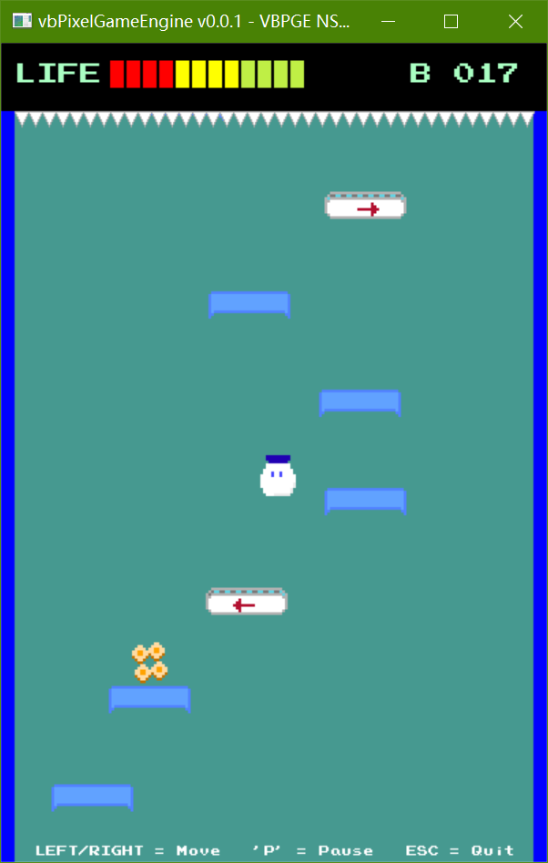

# NS-Shaft Remake Using `vbPixelGameEngine`

  


## Description  
This project is a remake of the 1997 arcade-style game *NS-Shaft* (originally published by Nagi-P Soft), built using [@DualBrain](https://github.com/DualBrain)'s `vbPixelGameEngine`. While staying true to the original game's core loop, this remake introduces custom hand-crafted graphics (created in Aseprite) and unique thematic elements tied to personal experiences:

- The main character is inspired by "Zhongnong Yogurt", a beloved school-branded yogurt from my alma mater.  
- Collectible items are designed after **isatis root** (in Chinese, 板蓝根 bǎn lán gēn), a well-known Chinese medicinal herb used in Traditional Chinese medicine, or TCM.  

For reference on the visual inspiration behind these elements, see the image below:


## Gameplay Instructions
- **Movement**: Use the LEFT/RIGHT arrow keys to navigate. Strategic platforming is key to progression.  
- **Objective**: Survive as long as possible in an endless vertical shaft, descending to deeper "basements" (the maximum depth is Basement 999).
- **Health System**: Start with 12 HP. Avoid:
  - Top spikes (deal -4 HP on contact).
  - Spike trap platforms (deal -2 HP when stepped on).  
- **Power-Ups**: Collect "isatis root" items to restore 1 HP (capped at the initial 12 HP).  
- **Special Platforms**: Exercise caution with:  
  - Fragile platforms: Collapse immediately after being stepped on.
  - Bouncing blocks: Launch the player upward when landed on.
  - Conveyor belts: Push the player left or right automatically.
- **Game Over**: Triggered by either falling off the screen or depleting all HP.

## Prerequisites  
To run this project, ensure you have the following installed:  
- [.NET SDK](https://dotnet.microsoft.com/download): version 8.0 or later (required for VB.NET compilation).  
- IDE: Visual Studio 2022 (recommended) or Visual Studio Code.  
- NuGet Packages:  
  - **System.Drawing.Common 9.0.0+** 
  - **NAudio 2.2.1** - for background music playback  

## How to Play  
1. **Clone the Repository**:  
  ```bash  
  git clone https://github.com/Pac-Dessert1436/VBPGE-NS-Shaft-Remake.git  
  cd VBPGE-NS-Shaft-Remake  
  ```  
2. **Restore Dependencies**:
  Run `dotnet restore` in your terminal to install required NuGet packages.  
3. **Two Options to Launch the Game**:  
  - Click the "Run" button  to build and run in Visual Studio 2022.  
  - Use the command `dotnet run` in the terminal in VS Code.  
4. **Controls Summary**:

| Action              | Key(s)                |
|---------------------|-----------------------|  
| Move Left/Right     | LEFT/RIGHT Arrow Keys |
| Pause/Resume Game   | 'P'                   |
| Restart (Game Over) | 'R'                   |
| Quit Game           | 'ESC'                 |


## Personal Notes  
As I write this on early September, I've been struggling to focus on preparing for the Postgraduate Entrance Exam while staying home. This game project, including my private VB.NET WinForms app that will be mentioned below, have kept me grounded, though.

Recently I built a private VB.NET WinForms app to quiz myself on TCM properties (for example, questions like *"Describe the medicinal properties of mint"*, which will be shown in the screenshot below). The WinForms app has become critical for my exam prep, although the content of the app is written all in Chinese. *__From my study materials, mint is defined in TCM as having two key effects:__*
- First, it relieves symptoms like fever or sore throat caused by wind-heat (a kind of external heat described in TCM).
- Second, it helps alleviate headaches or stuffiness linked to the wind-heat imbalance.

That's why coding `Presets.Mint` for this *NS-Shaft* game feels like a small, fitting comfort - it's a little "healing" moment that ties back to the TCM studying I'm focusing on right now.


Now let me cut to the chase. This *NS-Shaft* remake is a long-overdue idea inspired by the "Zhongnong Milk Marketing Contest" I entered as a freshman. By the time, my programming skills were too limited, but now, with `vbPixelGameEngine`, I finally brought this concept to life, even though that contest no longer exists since my sophomore year.

Home life has been quite noisy and overwhelming lately, so I'm relieved to soon relocate to Zengcheng Library, where I can focus better on exam prep (specifically TCM Chemistry) and ease my accumulated stress. This will be my last GitHub update for a while as I prioritize studying, but I'm proud to share this game before stepping back by the end of this year.

## License  
This project is licensed under the **MIT License**. See the [LICENSE](LICENSE) file for details.